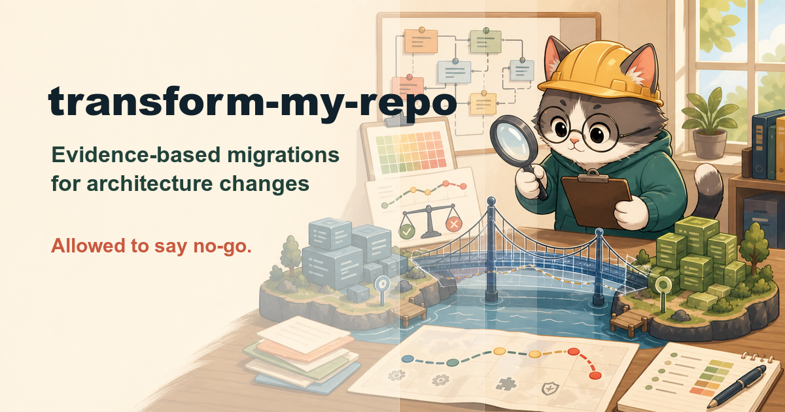

# transform-my-repo

**Evidence-based feasibility and migration strategy for architecture
transformations — allowed to tell you "don't".**

`transform-my-repo` is an [agent skill](https://vercel.com/docs/agent-resources/skills)
for the big, scary changes: porting to another language (PHP→Python,
Rust→Go, Assembly→C#), migrating between frameworks (Vue→Next.js, React
SPA→Next.js), re-platforming standalone software as a service, or adopting
a framework in a vanilla codebase. Migrations die from optimism —
the equivalent library that doesn't exist, the runtime behavior nobody knew
was load-bearing, the big-bang rewrite that never ships. This skill replaces
optimism with a census.

## What it does

```
/transform-my-repo PHP → Python, driver: team hiring, root: .
```

1. **Frame** — source → target, the *driver* (why migrate — the verdict is
   only meaningful relative to it), constraints, transformation type(s).
2. **Source census** — full inventory plus three migration-specific
   censuses: every dependency (with call-site depth), every platform
   coupling (runtime semantics the code secretly relies on), and the
   operational reality (deploy pipeline, data scale, background jobs —
   migrations fail on ops as often as on code), all with `file:line`.
3. **Target ground truth** — every census entry verified in the target
   ecosystem *now* (registry/docs, URL + version). "Surely Python has an
   equivalent" is not evidence. Missing equivalents are the headline finding.
4. **Gap analysis + difficulty heatmap** — semantic gaps (typing,
   concurrency, numerics, error idioms) and a per-module difficulty ranking:
   the concrete answer to "what will be hard".
5. **Verdict** ⛔ — **GO / PARTIAL / NO-GO** as a compact 10–20 line brief
   with the evidence shown, then stops for the user's decision. A NO-GO
   names the cheaper alternative that serves the driver — and counts as a
   successful outcome.
6. **Strategy** — behavioral parity harness first (golden-master tests pin
   current behavior before anything moves), then a decided migration
   pattern (strangler fig by default; big-bang must be proven unavoidable),
   coexistence bridge, per-phase cutover and rollback — with every cutover
   action classified REVERSIBLE or ONE-WAY, and ONE-WAY actions requiring
   explicit user confirmation.
7. **Assessment document** — `docs/TRANSFORM.md`: verdict, censuses, heatmap,
   strategy, a pre-mortem risk register, and a phased roadmap where Phase 1
   is a low-risk calibrator module delivered as a walking skeleton
   (deployed end-to-end through the real coexistence bridge), every
   surviving unknown becomes a named spike task, and every phase is sized
   to be one [deep-plan](https://github.com/silkyland/deep-plan) run.

## Covered transformation types

| Type | The trap it guards against |
|------|---------------------------|
| Language/stack port | Assuming semantic equivalence (runtime model, typing, numerics, error idioms) |
| Framework → framework | "Same language, so it's mostly renaming" — the rendering model, reactivity model, and ecosystem compatibility are the real migration |
| Standalone → as-a-service | Treating it as a deployment change when it's a data-model and security change (multi-tenancy, isolation, authn/z, ops you now own) |
| Vanilla → framework | Adopting the letter but not the inversion of control — two architectures forever |
| Major version upgrade (Vue 2→3, Python 2→3) | "Change the number" — a major with a broken plugin ecosystem is a port in disguise |
| Monolith ↔ microservices | The distributed monolith; "for scale" with no measured bottleneck |
| Database / storage migration | "SQL is SQL" — dialects, engine-shaped access patterns, zero-downtime math |
| Hosting / runtime (cloud, containers, serverless) | Lift-and-shift billed as transformation; serverless for workloads that hate it |
| Sync → async / event-driven | Same coupling, now with queues — and eventual consistency shipped to users |
| API paradigm (REST → GraphQL/gRPC) | N+1 resolvers, per-field authz, clients you forgot existed |
| UI platform shift (desktop ↔ web ↔ mobile) | Estimating the UI rewrite while the cost hides in toolkit-entangled logic |

Each type in the catalog carries a **feasibility profile** — the signals
that usually decide GO vs NO-GO — so the verdict starts from priors, not
from a blank page.

And the question behind all of them — **"is it worth it?"** — gets an
explicit break-even test in the verdict: the concrete benefit in the
driver's own unit, the cheaper do-nothing alternative, and roughly when
cumulative benefit passes the one-time cost. "We can migrate" and "we
should" are different answers.

Combined transformations (port **and** SaaS-ify) are sequenced, not stacked —
a parity harness can't isolate which change broke behavior when both move at once.

## The skill family

| Skill | Moment |
|-------|--------|
| [know-my-repo](https://github.com/silkyland/know-my-repo) | Day one: onboard onto a repo with zero knowledge |
| [deep-plan](https://github.com/silkyland/deep-plan) | Plan the next feature/refactor — evidence-gated, 7 phases |
| [deep-plan-ingest](https://github.com/silkyland/deep-plan) | Distill an accepted plan into living knowledge files |
| [clean-slate](https://github.com/silkyland/clean-slate) | Reset rotten knowledge files — backup-gated |
| **transform-my-repo** | Change the architecture: migration feasibility + strategy |
| [twin-my-site](https://github.com/silkyland/twin-my-site) | Extend the web product with a native mobile twin |
| [jury-my-repo](https://github.com/silkyland/jury-my-repo) | Multi-agent adversarial audit with a verified verdict |
| [love-me-love-my-docs](https://github.com/silkyland/love-me-love-my-docs) | A user manual that regenerates itself |
| [seed-ah](https://github.com/silkyland/seed-ah) | Fake-but-production-like demo data with a manifest |
| [create-my-team](https://github.com/silkyland/create-my-team) | Spawn and manage a subagent team for any mission |
| [reproduce-my-bug](https://github.com/silkyland/reproduce-my-bug) | Prove the bug before anyone fixes it |

Shared law: **no claim without evidence** — here on both sides of the
migration: source facts need `file:line`, target facts need a versioned
registry/docs citation fetched now.

## Install

```bash
npx skills add silkyland/transform-my-repo
```

Or copy this directory into your agent's skills folder
(e.g. `~/.claude/skills/transform-my-repo/`).

## Structure

```
transform-my-repo/
├── SKILL.md                              # 8-step workflow + the verdict gate
└── references/
    ├── transformation-catalog.md         # Type-specific checklists (port / SaaS / framework)
    ├── feasibility-rubric.md             # Heatmap scoring + GO/PARTIAL/NO-GO rules
    └── assessment-template.md            # docs/TRANSFORM.md structure
```

Follows the [Vercel skills](https://github.com/vercel-labs/skills) single-skill
layout and [Anthropic's skill authoring best practices](https://platform.claude.com/docs/en/agents-and-tools/agent-skills/best-practices).

## License

MIT
